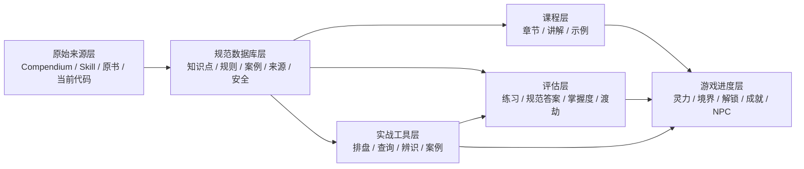

# 天机卷主 PRD

- 文档状态：Validation hold；待数据库/排盘审计与本文 fresh review 阻塞项关闭
- 版本：0.1
- 更新日期：2026-07-11
- 适用范围：统一产品（Product C）及其 Product A、Product B、Database 子系统
- 历史依据：`database/xuanxue/compendium-new/` 中的 `APP-SPEC*`、`GAME-DESIGN.md`、`DIFFICULTY-MAP.md` 与 `CC-FIRST-TASK.md`
- 配套文档：`DATABASE_COVERAGE_MATRIX.md`、`PROMINENT_SOURCE_MANIFEST.md`

## 0. 旧规格与当前文档位置

旧项目没有单一的 `PRD.md`；产品主旨分散在原始 compendium 根目录的多份规格中。原始目录仍保留在：

- `/Users/junshi/xuanxue-compendium-new/`
- `/Users/junshi/xuanxue-compendium-vision api/`

天机卷仓库内的 canonical 历史副本位于：

- `database/xuanxue/compendium-new/`
- `database/xuanxue/compendium-vision-api/`

截至 2026-07-11，下面六份关键规格与 `/Users/junshi/xuanxue-compendium-new/` 原件逐字节一致：

| 旧文件 | 原本职责 | 当前去向 |
|---|---|---|
| `APP-SPEC.md` | Product C 总规格：工具、教学、测验和 AI | 本文的统一产品定义、系统模型与需求 |
| `APP-SPEC-A.md` | Product A：先做排盘与 AI 解读工具 | 本文实战工具层、当前产品基线与复用决策 |
| `APP-SPEC-B.md` | Product B：修仙学堂、学习、答题、灵力与渡劫 | 本文修仙学堂、学习循环、首个可玩版本与教学需求 |
| `GAME-DESIGN.md` | 境界、NPC、成就、道侣与长期剧情 | 本文游戏进度与叙事层；完整旧设计继续作为后续资产保留 |
| `DIFFICULTY-MAP.md` | 各领域必修、进阶和专研分级 | `DATABASE_COVERAGE_MATRIX.md` 与未来知识点难度字段的候选输入 |
| `CHANGELOG.md` | 旧阶段计划和开发顺序 | `meta/TIANJI_PROJECT_ROADMAP.md` 与根目录 `CHANGELOG.md` |

当前重组后的权威文档分工：

| 当前文件 | 权威职责 |
|---|---|
| `docs/PRD.md` | 当前产品主旨、范围、需求和验收合同 |
| `docs/DATABASE_COVERAGE_MATRIX.md` | 每个知识域已有数据、运行时、验证状态和缺口 |
| `docs/PROMINENT_SOURCE_MANIFEST.md` | 原始资料、典籍、版本见证和现代边界来源清单 |
| `docs/DATABASE_SOURCE_DOCTRINE.md` | 典籍见证、传统解释、现代边界和产品呈现的分层规则 |
| `docs/DATABASE_VALIDATION_PLAN.md` / `LEDGER.md` | 验证方法、逐项证据与结果 |
| `docs/meta/TIANJI_PROJECT_ROADMAP.md` | 从数据库验证到教学游戏切片的阶段顺序 |
| `docs/meta/TIANJI_TASK_SUPERVISOR_STATE.json` | 当前执行状态和下一步的机器可读快照 |

历史规格继续作为证据和设计资产保存；发生冲突时，以本文及上述当前状态文档为准，不反向改写旧文件。

## 1. 执行结论

天机卷下一阶段沿用当前项目，停止横向扩充排盘模块，按以下路线推进：

1. 保留并治理当前已经完成的实战工具层（Product A）。
2. 恢复原计划中的教学游戏层（Product B），把它作为下一阶段主推进线。
3. 让两者共享同一套可溯源 Database、用户进度和实战记录，逐步合并为统一产品（Product C）。

当前 repo 已形成大系统中先行完成的实战子系统。项目还缺课程、练习、评估、掌握度、灵力、境界、渡劫和长期学习动机。

## 2. 产品定义

### 2.1 一句话定义

天机卷是一套以中国传统术数与中医知识为底座、以修仙成长为表现形式、让用户在学习、练习和实战中逐步掌握知识的互动系统。

### 2.2 用户获得的核心价值

- 学得懂：复杂术语被拆成有顺序的课程和例子。
- 练得会：每个知识点都有可复核的练习、解释和纠错。
- 用得上：排盘、查询、案例和体质/养生工具成为课程后的实战场。
- 走得远：境界、灵力、渡劫、成就和角色关系把长期学习进度变得可感知。
- 查得到：关键结论可以回到知识条目和来源；AI 临场生成不承担唯一依据。

### 2.3 目标用户

主要用户：

- 对易经、术数或中医感兴趣，但不知道从哪里开始的初学者。
- 用过排盘工具，却看不懂盘面和 AI 解读依据的用户。
- 希望通过游戏化进度长期学习的用户。

次要用户：

- 已有基础，希望系统复习、做题和案例练习的进阶用户。
- 只使用排盘或查询工具，但愿意在使用过程中补足知识的实战用户。

非目标用户：

- 需要医疗诊断、处方、急症处理或替代正规诊疗的人。
- 要求系统对财富、感情、健康等结果作确定性承诺的人。
- 只追求重战斗、开放世界或多人竞技体验的核心游戏玩家。

## 3. 产品承诺与边界

### 3.1 产品承诺

产品负责提供结构化学习、可解释练习、传统文化工具和可追踪进度。AI 负责解释、变式、对话和复盘；知识库提供事实和规范答案。

### 3.2 非目标

- 首版不做开放世界、实时战斗、复杂经济或 PvP。
- 首版不同时开发全部知识域。
- 首版不实现旧 `GAME-DESIGN.md` 中所有 NPC、道侣与隐藏剧情。
- 不把 compendium、Skill 或 AI 输出直接宣称为已校勘权威结论。
- 不把“八字看健康”等术数交叉内容包装为中医或现代医学诊断。
- 不允许 AI 单独生成测验规范答案并直接计入掌握度或渡劫结果。
- 不把具体方药、剂量、针刺或艾灸建议作为无安全门槛的普通游戏奖励。

## 4. 设计原则

1. 学习先于数值。灵力、境界和成就必须对应真实学习行为。
2. 规范答案可追踪。评分题必须关联已接受的知识条目与解释。
3. 计算与解释分离。排盘由确定性引擎完成，AI 只解释结构化结果。
4. 来源与观点分离。传统规则、整理者判断、AI 解读和现代安全提醒分别标注。
5. 一域一闭环。先完成一个领域的完整体验，再横向扩充目录。
6. 高风险内容先过门槛。中医方药、穴位、身体不适和红线征象需要独立安全字段与展示规则。
7. 现有资产分层复用。壳层、交互、账户、历史记录和 AI Provider 优先保留；每个领域算法与静态表通过来源映射、fixture 和独立复算后，才可进入可信教学/评估路径。
8. 典籍见证优先。传统知识先回答“哪部典籍、哪个版本、哪一段这样记载”；现代科学、监管和安全资料另作边界层，不替代或删除历史内容。
9. 原文与转述分离。每个拟进入系统的传统条目必须逐条引用；找不到出处的旧整理可保留为候选，但不能冒充原典或规范答案。

## 5. 系统模型

### 5.1 Database：共同知识底座

职责：

- 保存原始来源和导入版本。
- 把知识拆成可复用的规范化条目。
- 记录来源链、适用知识域、难度、关系和校勘状态。
- 为课程、题目、AI Context 和实战解释提供同一事实入口。
- 为中医内容提供安全级别、禁忌、剂量来源和红线规则。
- 按“典籍见证、传统解释、现代边界、产品呈现”四层保存知识，完整规则见 `DATABASE_SOURCE_DOCTRINE.md`。

Database 不直接面向玩家，也不因导入 raw source 而自动完成。

### 5.2 修仙学堂（Product B）：教学游戏主线

职责：

- 把知识点组织为课程单元和学习路径。
- 提供练习、错题解释、掌握度与复习。
- 通过灵力、境界、渡劫和解锁表现学习进度。
- 在核心循环稳定后接入 NPC、剧情、成就和每日任务。

### 5.3 实战工具层（Product A）：实践与验证场

职责：

- 提供六爻、梅花、八字、紫微、奇门、风水等确定性排盘。
- 提供 64 卦、姓名、择日等查询或计算工具。
- 提供体质、子午流注、五运六气等传统养生学习工具。
- 产生可供课程复盘的结构化实战记录。

实战工具承担统一产品的实践与验证环节。当前代码可作为待审计的实现基线；在对应领域通过正确性和安全门槛前，不得作为课程规范答案或计分依据。

### 5.4 游戏进度与叙事层

核心机制：

- 灵力：完成课程、练习、复习和实战后获得的学习进度反馈。
- 掌握度：按知识点或领域记录真实正确率、复习状态和实战表现。
- 境界：代表学习阶段；达到条件后仍需通过渡劫。
- 渡劫：由已校勘知识点组成的阶段评估，不由 AI 即兴决定答案。
- 解锁：开放下一阶段课程、实战模式或内容，不以制造无意义限制为目的。
- NPC/剧情：承担教学风格、反馈和长期关系，不取代知识内容。

旧规格中的 15 级境界、30+ 成就、4 位 NPC 与 4 条道侣线保留为设计资产，不作为首版硬范围。

## 6. 核心体验循环

### 6.1 单课循环

进入课程 → 学习一个知识点 → 看例子 → 做 1 至 3 道练习 → 获得解释 → 更新掌握度与灵力 → 推荐下一步。

### 6.2 阶段循环

完成必修知识 → 达到掌握度门槛 → 参加渡劫 → 通过后升阶并解锁新内容 → 失败则生成针对性复习路径。

### 6.3 实战循环

从课程进入对应工具 → 完成排盘或案例 → 系统提取本次涉及的知识点 → 用户做判断或复盘 → 获得实战评价和领域进度。

### 6.4 长期循环

每日复习或实战 → 累积领域掌握度 → 解锁成就、角色反馈和剧情 → 回到更高阶课程与案例。

## 7. 内容与领域范围

| 内容组 | 主要知识域 | 产品作用 |
|---|---|---|
| 基础通识 | 阴阳、五行、天干地支、八卦、64 卦 | 全部术数课程的前置知识 |
| 占筮 | 易经、六爻、梅花 | 最适合率先连接课程与现有工具 |
| 命理 | 八字、紫微 | 中期课程与实战案例 |
| 时空术数 | 奇门、风水、择日、六壬 | 进阶/专研内容与工具 |
| 中医 | 理论、四诊辨证、体质、病种、中药、方剂、针灸、经典、安全 | 学习参考与传统养生知识；高风险内容受独立门槛约束 |
| 应用工具 | 姓名、64 卦查询、万年历 | 低门槛实用入口 |
| 相术 | 面相、手相、望诊 | 传统文化/视觉交互内容；与医疗诊断严格分域 |

各领域的当前覆盖和可补内容以 `DATABASE_COVERAGE_MATRIX.md` 为准。

## 8. 当前产品基线

### 8.1 已完成或已有资产

当前 repo 已有 13 个业务模块：

- 占算：六爻、梅花、八字、紫微、奇门、风水。
- 中医/养生：体质、子午流注、五运六气、八字健康、望诊。
- 相术：面相、手相。
- 共用能力：用户账户、历史记录、AI Provider/模型切换、流式解释、相机/图像输入、真太阳时与城市数据。

这些资产主要属于 Product A，并且已经超过旧 `APP-SPEC-A.md` 的部分范围。

### 8.2 尚未形成的主线能力

- 没有课程、知识点进度和学习路径。
- 没有可追溯规范答案的题库与练习系统。
- 没有灵力、境界、渡劫、解锁或错题复习。
- 没有 NPC 教学、成就、每日任务或剧情系统。
- 没有统一的规范数据库；目前是 raw source 与功能内静态 JS 表并存。
- 没有独立的姓名、择日、64 卦查询和六壬工具。

### 8.3 重搭决策

结论：基于当前项目继续，不从头重搭。

保留：前端框架、模块接口、账户/历史、AI 调用层和已验证交互。排盘引擎和领域静态表按域决定保留、修复或替换。

新增：规范数据库、课程/评估模型、学习状态、游戏进度和工具实战事件。

允许替换：缺少来源、验证失败或安全边界不足的静态数据和提示词内容。

## 9. 首个可玩版本

### 9.1 范围

首个可玩垂直切片只覆盖“练气期基础通识”。范围包括：

- 道号与学习档案。
- 阴阳、五行、天干地支、八卦四组微课程。
- 每课 1 至 3 道可复核练习。
- 知识点掌握度、灵力和课程进度保存。
- 5 至 8 道练气渡劫题，80% 为通过线。
- 通过后解锁筑基入口和一个已校验的 64 卦/六爻最小实战事件；事件要求用户应用至少一个已学知识点并完成复盘。
- 错题回到具体知识条目，并给出来源化解释。

AI 可改写讲法、生成等价练习表述和扮演教学角色，但规范答案、评分条件和知识点关系来自数据库。

### 9.2 暂不进入首个版本

- NPC 好感、道侣、隐藏剧情。
- 每日任务、社交、斗法、排行榜。
- 全部排盘工具的学习事件接入。
- 中医方药、针灸或症状辨证课程。
- AI 自由文本作为渡劫的唯一评分方式。

## 10. 功能需求

### 10.1 Database

| ID | 需求 |
|---|---|
| DB-001 | 每个规范化知识条目必须有稳定 ID、知识域、类型、正文、来源指针、版本和状态。 |
| DB-002 | 来源状态至少区分 raw、normalized、reviewed、accepted、deprecated。 |
| DB-003 | 规则、案例、口诀、经典原文与整理者解释必须分类型保存。 |
| DB-004 | 题目必须关联被考知识点、规范答案、解释与来源。 |
| DB-005 | 中医条目必须支持安全级别、禁忌、毒性、剂量来源、红线与就医升级字段。 |
| DB-006 | 同一知识点允许多来源并存，并记录一致、补充或冲突关系。 |
| DB-007 | 许可未知、非商业或权利不明内容默认 `internal_only`，不得进入对外课程、内容包或 AI 可引用上下文。 |
| DB-008 | 传统条目必须保存作品、版本见证、定位、原文、归一化转述、归属状态和 `source_ref`；原文与现代解释不得混写。 |
| DB-009 | 现代监管/安全资料只决定当前使用边界，不得替代医经、方书、术数典籍等传统内容来源，也不得据此删除真实文献记载。 |

### 10.2 教学

| ID | 需求 |
|---|---|
| EDU-001 | 课程按前置关系和难度组织，不直接按文件目录整篇展示。 |
| EDU-002 | 每个课程单元有学习目标、知识点、示例、练习和掌握条件。 |
| EDU-003 | 用户可看到已完成、待复习、未解锁和掌握度状态。 |
| EDU-004 | 错误反馈必须解释原因并链接到相关知识点。 |
| EDU-005 | AI 教学对话只能引用当前允许的知识上下文，并显示无法确认的边界。 |

### 10.3 评估

| ID | 需求 |
|---|---|
| ASM-001 | 选择、配对、排序和结构化判断题使用数据库规范答案自动评分。 |
| ASM-002 | AI 可评议开放题，但不在无人工/规则复核时单独决定关键升阶。 |
| ASM-003 | 渡劫题目只覆盖当前境界必修知识。 |
| ASM-004 | 渡劫失败不清空进度，并生成针对薄弱知识点的复习建议。 |
| ASM-005 | 题目、选项、答案和解释之间必须通过一致性校验。 |

### 10.4 游戏进度

| ID | 需求 |
|---|---|
| GAME-001 | 灵力只能由明确的学习、练习、复习或实战事件产生。 |
| GAME-002 | 境界升级同时检查灵力、必修完成度和渡劫结果。 |
| GAME-003 | 奖励不得鼓励用户反复刷无意义操作或高风险中医内容。 |
| GAME-004 | 游戏数值与学习掌握度分开保存，避免“等级高但不会”。 |
| GAME-005 | NPC、成就和剧情必须订阅学习事件，不直接篡改知识评分。 |

### 10.5 实战工具

| ID | 需求 |
|---|---|
| TOOL-001 | 排盘结果由本地确定性引擎产生，并可保存结构化结果。 |
| TOOL-002 | AI 解读必须区分盘面事实、传统规则和推断性解释。 |
| TOOL-003 | 工具可在用户同意后生成实战学习事件，关联领域和知识点。 |
| TOOL-004 | 未学内容允许预览，但是否设置解锁限制由体验测试决定，不以强制锁功能作为默认。 |

### 10.6 安全、隐私与权利

| ID | 需求 |
|---|---|
| SAFE-001 | 全局声明不能替代具体中医条目的安全提示。 |
| SAFE-002 | 急危重症、疑似中毒、妊娠与毒性药必须触发对应硬规则。 |
| SAFE-003 | 针刺等有创操作不得提供自行操作流程。 |
| SAFE-004 | 生辰、健康描述、图像与历史记录按敏感数据管理；默认最小化保存和传输。 |
| SAFE-005 | 非商业许可证或权利不明来源不得无条件进入商业产品内容包。 |

### 10.7 身份、事件与版本

| ID | 需求 |
|---|---|
| DATA-001 | 账户、匿名学习档案和道号必须映射到稳定主体 ID；合并或登录迁移不能制造两套掌握度。 |
| DATA-002 | 课程、答题、复习和实战事件具有稳定事件 ID、主体 ID、事件类型、知识点引用、payload 版本、发生时间和幂等规则。 |
| DATA-003 | 已保存答案、盘面和评分必须回指当时使用的知识条目版本与算法版本，后续修订不得静默改写历史。 |
| DATA-004 | Product C 的服务端数据为登录用户的 canonical state；localStorage 只作匿名草稿、缓存或迁移来源，不形成第二套长期事实。 |

## 11. AI 使用边界

AI 适合：

- 用不同语气解释同一已接受知识点。
- 根据知识点生成变式题草稿，并接受自动校验或人工审核。
- 对开放题给出形成性反馈。
- 扮演 NPC、生成过渡对话和复盘总结。
- 根据结构化盘面组织解释，但必须保留传统解释的不确定性。

AI 不负责：

- 决定排盘计算结果。
- 无来源生成知识事实或规范答案。
- 单独批准渡劫通过。
- 作医疗诊断、开方或替代专业意见。
- 把传统推断包装成现代科学结论。

本节显式 supersede 旧 `APP-SPEC.md` 的“AI 出题 -> AI 评判”和旧 `APP-SPEC-B.md` 的“渡劫题实时生成、不需要题库”。AI 可生成草稿或等价表述；计分前必须绑定已审知识条目、规范答案、解释、版本和校验状态。

## 12. 数据与安全策略

- raw source 只读保存，不在原文件上直接“修正”。
- 规范化数据库保存派生条目，并回指 raw source 的文件与定位。
- 冲突不通过覆盖旧值解决，而是记录来源差异和采纳决定。
- Product A 当前静态 JS 表视为“运行时现状来源”，需要反向纳入审计。
- 中医 Skill 可全部保留在 raw 层，并按 Coverage Matrix 分批吸收；高风险安全表优先。
- 中医理论、古方、医家和食疗的文化知识以医经、本草、方书、医案与可定位版本为核心；卫健委、药监、药典和现代临床资料只附加现行身份、安全和现实使用边界。
- 面相、手相等传统外观判断只要有典籍见证即可进入文化知识层；不得因现代不可验证而删除，也不得把无出处的现代扩写伪装成古籍原文。
- 许可或权利未确认的内容从导入起即标记 `internal_only`；对外发布前再逐项确认引用方式和商业使用边界。

## 13. 成功指标

产品指标：

- 新用户能够完成第一课并理解下一步。
- 首个会话中完成至少一次练习并收到可理解的纠错。
- 完成练气期课程的用户能凭所学内容通过渡劫；系统需要识别并阻止重复猜题刷过关。
- 用户从课程进入实战工具后，能说清盘面中至少一个关键概念。
- 学习用户在 7 天内有复习、继续课程或实战回访。

质量指标：

- 计分题 100% 关联知识点、答案、解释和来源。
- 不存在未标来源的 accepted 知识条目。
- 中医高风险条目 100% 具有安全字段和显示策略。
- 确定性排盘回归用例通过后才进入课程实战。
- AI 输出失败不会改变已保存的知识评分或升阶状态。

## 14. 阶段与验收

### V0 正确性与当前产品安全门槛

完成条件：八字与共享历法形成保留/修复/替换结论；所有当前 runtime 数据消费点进入 validation ledger；Product A 中具体药味、剂量、穴位、艾灸和健康风险输出完成 inventory，未达安全等级的路径被隔离。

### P0 主线恢复与数据库基线

完成条件：主 PRD、Coverage Matrix、Source Manifest 一致；主要来源已登记；Product C 身份/事件/版本合同成立；用户确认产品关系和包含最小实战事件的首个垂直切片。

### P1 教学核心可玩切片

完成条件：用户可完成四组基础课程、练习、进度保存和一次练气渡劫；每道计分题可追踪到知识条目。

### P2 实战工具连接

完成条件：至少一个现有工具能生成结构化实战事件、关联已学知识并触发复盘和掌握度更新。

### P3 多领域扩展

完成条件：按 Coverage Matrix 扩展的每个新领域都具备来源、规范化条目、课程、题目和验证证据。

### P4 叙事与长期养成

完成条件：NPC、成就、每日和关系系统能提升学习继续率，并且不影响知识评分和安全边界。

## 15. 主要风险与处理

| 风险 | 处理 |
|---|---|
| 继续以“新增模块数”代替主线进度 | 以后以可玩的学习闭环和玩家掌握结果计进度。 |
| compendium 内容广但来源字段不足 | 先做候选条目与 provenance，不直接标 accepted。 |
| AI 题目看似丰富但答案不稳定 | 数据库保存规范答案；AI 只做受约束变式和讲解。 |
| 中医内容增加后安全风险同步扩大 | 第一批规范化先做安全表、红线和分级，不先扩方药推荐。 |
| 旧游戏设计体量过大 | 核心循环稳定前冻结道侣、社交和复杂剧情。 |
| 非商业或权利不明来源影响发布 | raw 层保留研究价值；商业内容包另做授权或可商用来源替换。 |
| 现有代码与新数据模型割裂 | 先建立适配层和实战事件，不重写全部排盘模块。 |

## 16. 决策记录

- 2026-07-09：确认 `xuanxue-compendium-new` 是当前主上游资料，`vision-api` 版本只作对照。
- 2026-07-09：确认当前 repo 继续保留，定位为 Product A 的已实现主体。
- 2026-07-09：确认下一阶段以 Product B 教学核心循环为主，不继续横向堆排盘模块。
- 2026-07-09：确认 compendium 与中医 Skill 均作为可补充、可校正的候选来源；不要求其先成为“完整正确的生产数据库”。
- 2026-07-09：首个可玩切片默认采用练气期基础通识；如产品负责人更偏好六爻入门，可在 P1 开工前调整，但仍保持单域闭环原则。
- 2026-07-09：Fresh review 结论为 hold；壳层/基础设施与领域引擎分层复用，旧 AI 实时出题计分条款失效，V0 correctness 与当前中医安全盘点先于 P1。
